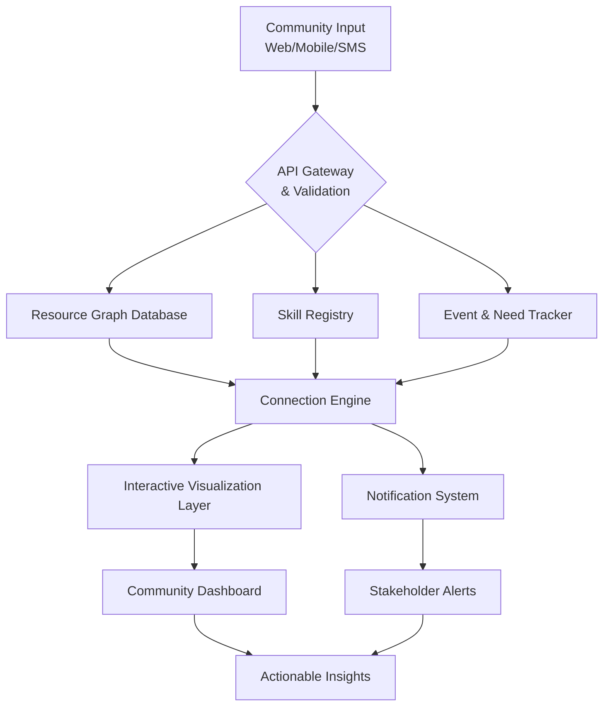

# 🌍 Community Resilience Atlas

[](https://phatthanachaisukhari.github.io/Equity-Mapping-Toolkit/)

## 📜 Overview: Mapping Collective Strength

**Community Resilience Atlas** is a dynamic, open-source platform that visualizes and connects community resources, skills, and mutual aid networks. Unlike traditional asset maps, this project transforms static location data into a living ecosystem of community capability, emphasizing human connections alongside physical resources. Imagine a digital tapestry where every thread represents a skill, resource, or individual willing to contribute—this platform weaves those threads into patterns of collective resilience.

Inspired by community mapping initiatives like gender-equity resources in Davis, this project expands the concept into a multidimensional framework for community preparedness, skill-sharing, and resource coordination during both everyday life and unexpected challenges. The platform serves as a community nervous system, facilitating connections before they're urgently needed.

## 🚀 Key Capabilities & Distinctive Approach

- **🌐 Adaptive Resource Network**: Dynamic mapping that shows not just *what* exists, but *how* resources connect and can be mobilized
- **🔗 Skill & Resource Pairing**: Intelligent matching of community needs with available skills and materials
- **📱 Multi-Access Interface**: Web platform, mobile-responsive design, and low-bandwidth text-based access
- **🌍 Multilingual Framework**: Built-in support for community languages with collaborative translation tools
- **🤝 Mutual Aid Coordination**: Tools for organizing resource sharing, skill exchanges, and support networks
- **📊 Resilience Analytics**: Visualizations of community strengths and potential vulnerabilities

## 🛠️ Technical Architecture



## 📦 Installation & Deployment

### Prerequisites

- Node.js 18+ or Python 3.10+
- PostgreSQL 14+ with PostGIS extension
- Redis for caching and real-time features
- Mapbox API key (community tier available)

### Quick Deployment

```bash
# Clone the repository
git clone https://phatthanachaisukhari.github.io/Equity-Mapping-Toolkit/

# Install dependencies
cd community-resilience-atlas
npm install  # or pip install -r requirements.txt

# Configure environment
cp .env.example .env
# Edit .env with your configuration

# Initialize database
npm run db:init  # or python manage.py migrate

# Start development server
npm run dev  # or python manage.py runserver
```

### Docker Deployment

```yaml
# Example docker-compose configuration
version: '3.8'
services:
  atlas-web:
    build: .
    ports:
      - "3000:3000"
    environment:
      - DATABASE_URL=postgresql://postgres:password@db:5432/atlas
      - MAPBOX_TOKEN=${MAPBOX_TOKEN}
    depends_on:
      - db
      - redis
  
  db:
    image: postgis/postgis:14-3.3
    environment:
      - POSTGRES_PASSWORD=password
      - POSTGRES_DB=atlas
    volumes:
      - postgres_data:/var/lib/postgresql/data
  
  redis:
    image: redis:7-alpine
```

## ⚙️ Configuration Examples

### Example Profile Configuration

```yaml
# community-profile.yaml
community:
  name: "Davis Mutual Aid Network"
  location:
    center: [38.5449, -121.7405]
    bounds: [[38.50, -121.80], [38.60, -121.65]]
  
  resources:
    categories:
      - food-security
      - medical-support
      - transportation
      - skill-sharing
      - emergency-shelter
  
  languages:
    primary: "en"
    supported: ["es", "zh", "ru", "ar"]
  
  privacy:
    data_retention_days: 90
    anonymize_public: true
    consent_required: true
  
  integrations:
    weather_alerts: true
    community_calendar: true
    local_services_api: "https://api.cityofdavis.org/services"
```

### Example Console Invocation

```bash
# Initialize a new community instance
atlas init --community "North Davis Network" \
           --admin-email "coordinator@community.org" \
           --region "38.56,-121.78,38.58,-121.74" \
           --modules "resources,skills,events,communications"

# Import existing community data
atlas import --format geojson \
             --file existing-resources.geojson \
             --category-map category-mapping.yaml

# Generate resilience report
atlas analyze --timeframe "30d" \
              --output-format html \
              --include "vulnerabilities,strengths,recommendations"

# Set up automated community check-in
atlas schedule --task "community-pulse" \
               --frequency "weekly" \
               --channel "sms,email" \
               --participants "all-verified"
```

## 📊 Platform Compatibility

| Operating System | Status | Notes |
|-----------------|--------|-------|
| 🪟 Windows 10/11 | ✅ Fully Supported | Desktop & server deployments |
| 🍎 macOS 12+ | ✅ Fully Supported | Native Apple Silicon optimization |
| 🐧 Linux (Ubuntu/Debian) | ✅ Fully Supported | Preferred for server deployment |
| 🐧 Linux (RHEL/Fedora) | ✅ Fully Supported | SELinux policies included |
| 📱 Android 10+ | ✅ Mobile Web | Progressive Web App capabilities |
| 📱 iOS 14+ | ✅ Mobile Web | Safari compatibility ensured |
| 🐳 Docker Container | ✅ Optimized | Multi-architecture images available |
| ☁️ Cloud Platforms | ✅ Extensive Support | AWS, Azure, GCP deployment guides |

## 🌟 Feature Ecosystem

### Core Mapping Engine
- **Adaptive Cartography**: Maps that reconfigure based on community needs and emergency contexts
- **Temporal Layers**: View resource availability across different times and conditions
- **Accessibility Overlays**: Highlight wheelchair-accessible, multilingual, and sensory-friendly spaces
- **Community Validation**: Crowd-sourced verification and updating of resource information

### Connection Fabric
- **Need-Skill Matching**: Algorithmic pairing of community requests with volunteer capabilities
- **Resource Routing**: Optimal paths for resource distribution during coordinated responses
- **Network Resilience Scoring**: Identify single points of failure in community support networks
- **Trust Building Features**: Graduated engagement pathways for new community members

### Communication Hub
- **Multi-Channel Alerts**: SMS, email, app notifications, and community radio integrations
- **Language Bridge**: Real-time translation for cross-language community coordination
- **Accessibility-First Design**: Screen reader optimized, high contrast, and keyboard navigation
- **Low-Bandwidth Mode**: Functional interface with minimal data requirements

### Analytics & Insights
- **Community Vitality Metrics**: Quantitative measures of connection density and resource distribution
- **Predictive Gap Analysis**: Identify potential resource shortages before they become critical
- **Historical Resilience Patterns**: Learn from past community responses to various challenges
- **Privacy-Preserving Analytics**: Aggregate insights without compromising individual data

## 🔌 API Integrations

### OpenAI & Claude API Integration

The platform includes thoughtful AI integration designed to augment (not replace) human community coordination:

```javascript
// Example: AI-assisted resource categorization
const aiCategorization = await resilienceAI.analyzeResource({
  description: "Community center with commercial kitchen, meeting rooms, and generator",
  context: "Emergency response planning for heat wave",
  models: {
    primary: "claude-3-sonnet", // For nuanced understanding
    secondary: "gpt-4-turbo" // For structural analysis
  },
  communityParameters: "Davis, CA, student population, elderly residents"
});

// AI applications include:
// - Natural language processing of community needs reports
// - Multilingual translation of urgent communications
// - Pattern recognition in resource utilization
// - Accessibility recommendations for community spaces
// - Generating plain-language explanations of complex situations
```

**Implementation Philosophy**: AI functions as a community assistant—handling repetitive tasks, breaking language barriers, and identifying patterns—while humans maintain decision-making authority and community relationship building.

### External Service Integrations

- **Weather & Hazard APIs**: Real-time integration with NOAA, USGS, and local emergency services
- **Public Transit Systems**: Dynamic routing incorporating public and community transportation
- **Local Government Portals**: Bidirectional data sharing with municipal services
- **Community Calendar Systems**: Synchronization with existing event platforms

## 🧭 Usage Scenarios

### Everyday Community Building
1. **Skill Library Creation**: Community members register abilities from plumbing to translation
2. **Resource Inventory**: Local organizations list available equipment, spaces, and materials
3. **Connection Events**: Platform suggests potential collaborations based on complementary resources
4. **Community Pulse Checks**: Regular, low-effort check-ins to maintain network awareness

### Preparedness Planning
1. **Scenario Modeling**: "What if" planning for various emergency situations
2. **Resource Gap Identification**: Systematic discovery of unmet community needs
3. **Response Team Formation**: Pre-identifying and connecting potential response coordinators
4. **Communication Pathway Testing**: Ensuring alert systems work before they're needed

### Active Response Coordination
1. **Dynamic Re-mapping**: Adjusting resource displays based on emergency context
2. **Need Prioritization**: Community-informed triage of response efforts
3. **Volunteer Mobilization**: Efficient matching of responders to appropriate tasks
4. **Resource Tracking**: Monitoring distribution of materials and equipment

## 📈 Community Impact Metrics

The platform includes built-in measurement of community resilience factors:

- **Connection Density**: Average number of viable support pathways per community member
- **Resource Redundancy**: Critical resources available from multiple sources
- **Response Latency**: Time from identified need to mobilized response
- **Participation Equity**: Distribution of engagement across community demographics
- **Knowledge Preservation**: Retention of community wisdom through transitions

## 🔒 Privacy & Ethics Framework

### Data Principles
- **Community Ownership**: Data about the community belongs to the community
- **Purpose-Limited Collection**: Only gather information with clear, consented purposes
- **Granular Privacy Controls**: Individuals control visibility of their information
- **Transparent Algorithms**: Community understanding of how connections are suggested
- **Sunset Provisions**: Automatic expiration of temporary crisis data

### Security Measures
- End-to-end encryption for sensitive communications
- Regular third-party security audits
- Principle of least privilege in data access
- Comprehensive audit logging of all data access
- Incident response plan for potential data issues

## 🧩 Extensibility & Customization

The platform is designed as a modular foundation:

```yaml
# Custom module development
module:
  name: "disability_access_audit"
  hooks:
    - location_added
    - resource_updated
  dependencies:
    - core_mapping
    - community_validation
  permissions:
    required: [ "community_moderator" ]
    granted: [ "audit_suggestions" ]
```

Community-specific adaptations might include:
- Cultural customization of interface and interaction patterns
- Integration with local government systems
- Specialized resource taxonomies for unique community contexts
- Custom reporting formats for different stakeholder groups

## 🤝 Contribution Pathways

### Technical Contributions
- **Mapping Enhancements**: Improved visualization techniques for complex community data
- **Accessibility Features**: Making the platform usable for everyone
- **Localization**: Translation and cultural adaptation for new communities
- **Integration Modules**: Connectors to local systems and services

### Community Contributions
- **Resource Verification**: Ground-truthing mapped resources
- **Use Case Documentation**: Stories of how the platform supports real community needs
- **Training Materials**: Guides for different community roles and technical comfort levels
- **Pattern Recognition**: Identifying common resilience strategies across communities

### Documentation
- **Implementation Guides**: Step-by-step community deployment processes
- **Case Studies**: Documented examples of platform use in various contexts
- **API Documentation**: For developers building complementary tools
- **Community Moderation Guidelines**: Maintaining healthy, productive community spaces

## 📚 Learning Resources

- **Interactive Tutorials**: Step-by-step platform orientation
- **Community of Practice**: Regular virtual gatherings of implementers
- **Implementation Playbook**: Guidance tailored to community size and context
- **Research Connections**: Academic partnerships studying community resilience
- **Youth Engagement Toolkit**: Materials for involving younger community members

## ⚖️ License

This project is licensed under the MIT License - see the [LICENSE](LICENSE) file for details.

The MIT License provides broad permissions for use, modification, and distribution, requiring only that the original license and copyright notice be included. This aligns with our philosophy of creating community-owned tools that can be adapted to local needs while maintaining a connection to the broader development community.

## 🚨 Disclaimer

**Community Resilience Atlas** is a tool for community coordination and should not be considered a replacement for professional emergency services, medical care, or government response systems. The platform relies on community-generated content whose accuracy cannot be independently verified by the development team. Users should:

- Verify critical information through multiple channels before acting
- Maintain traditional emergency preparedness measures alongside digital tools
- Understand that platform availability cannot be guaranteed during all emergency scenarios
- Recognize that digital divides may exclude some community members from participation

The development team disclaims liability for decisions made based on information within the platform. Communities using this tool assume responsibility for their local implementation, data management, and coordination practices. Regular testing of both technical systems and human coordination processes is strongly recommended.

## 🌟 Getting Started with Your Community

Begin your community resilience mapping journey with our comprehensive starter kit, including configuration templates, community engagement guides, and implementation checklists.

[](https://phatthanachaisukhari.github.io/Equity-Mapping-Toolkit/)

---

*Community Resilience Atlas is maintained by volunteers and contributors worldwide. Last updated: 2026*